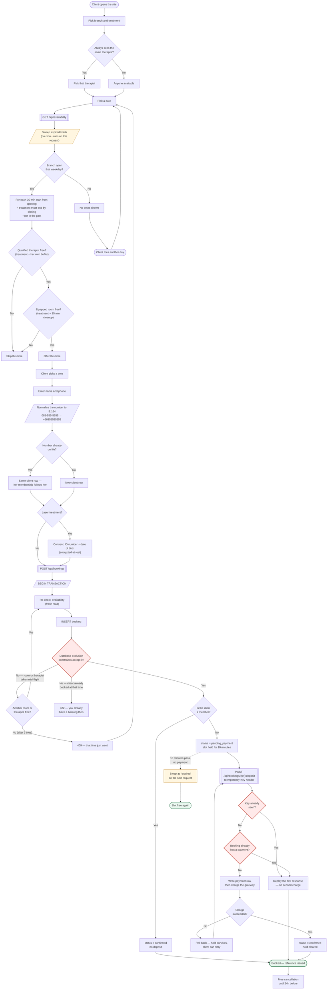

# Flowchart: a client's booking path

From opening the site to a confirmed booking. Renders on GitHub.

**Red** are the points where correctness is enforced under concurrency: the
database refusing an overlapping booking, and the two idempotency checks that
stop a second charge.

**Amber** are the lazy hold sweeps that stand in for the scheduled job the
hosting cannot run.

---

## The same path, told as a story

Nok wants laser hair removal at the Thonglor branch on a Saturday.

She picks the treatment and the branch, and says she only sees Pim. The site
asks the server what is free. Before answering, the server quietly releases any
abandoned holds - there is no background job, so this happens now, on her
request. It then walks Saturday in half-hour steps, keeping only times where Pim
is free *and* the laser suite is free for the treatment plus its fifteen minutes
of cleaning.

She picks 3pm. She types her number with dashes, the way she always writes it.
It is normalised before it is matched, so she is recognised as the same Nok who
came in March rather than becoming a second record with the same name - which
matters, because whether a deposit is due is decided by the record she lands on.

Because it is a laser treatment, she signs the consent and gives her ID number,
which is encrypted before it is stored.

Her booking goes in. At the same moment, a receptionist at the desk is entering
a phone booking for the same laser suite at 3pm. Both were looking at a free
slot. The database accepts exactly one of them. If Nok loses, she is told
immediately and shown other times - she is never given a confirmation for a slot
that is not hers. Last Christmas, both would have been written down.

Nok is not a member, so the slot is held for ten minutes while she pays the 300
deposit. Her phone drops the connection and she taps pay again. The second
request carries the same key as the first, so the server returns the original
result instead of charging her twice.

She gets a reference. She can cancel free until 3pm the day before.

Had she abandoned the payment, her hold would have lapsed after ten minutes and
been released the next time anyone asked about that Saturday.
